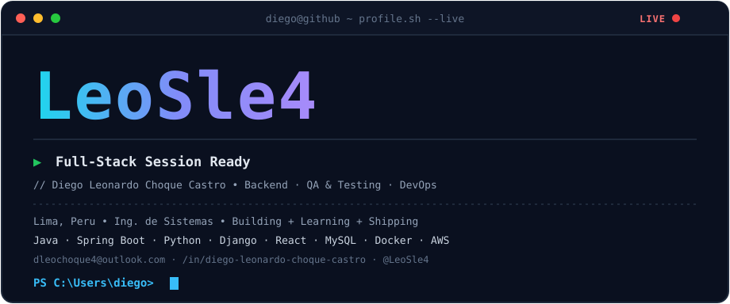

<!-- ============================================================ -->
<!--  GitHub Profile · LeoSle4 · Diego Leonardo Choque Castro     -->
<!--  Repo especial: crea un repo PÚBLICO llamado "LeoSle4"       -->
<!--  Sube:  README.md  +  assets/header.svg                       -->
<!--         .github/workflows/snake.yml  (para el gusano)         -->
<!--  Estilo inspirado en @jhony-vx  ·  tema oscuro navy/cian      -->
<!-- ============================================================ -->

  

 

## 👋 Sobre mí

Desarrollador **full-stack** con foco en **backend** y **calidad de software**.
Construyo APIs con **Java / Spring Boot** y **Python / Django**, interfaces con **React** (Vite, Tailwind),
y las respaldo con **pruebas funcionales, de API y unitarias (JUnit)**.
También trabajo el ciclo **DevOps** (Docker, AWS, CI/CD) y el **análisis funcional**:
historias de usuario, criterios de aceptación y flujos de proceso.

Metodología **Scrum** — he sido desarrollador, **Scrum Master** y **Product Owner** en proyectos universitarios.

> 🎯 **Objetivo:** crecer como desarrollador full-stack con testing y **liderar proyectos de desarrollo**.

  

  
  

---

## 🛠️ Stack

<table>
  <tr>
    <td valign="top" width="50%">
      <b>Backend</b>  
      
    </td>
    <td valign="top" width="50%">
      <b>Frontend</b>  
      
    </td>
  </tr>
  <tr>
    <td valign="top">
      <b>QA &amp; Testing</b>  
      
      &nbsp;
      
      
      
      
    </td>
    <td valign="top">
      <b>DevOps</b>  
      
    </td>
  </tr>
  <tr>
    <td valign="top">
      <b>Bases de datos</b>  
      
    </td>
    <td valign="top">
      <b>Herramientas</b>  
      
    </td>
  </tr>
</table>

---

## 🧪 QA — cómo trabajo la calidad

| Etapa | Qué hago |
|---|---|
| **Análisis** | Reviso la historia de usuario y sus criterios de aceptación; detecto ambigüedades antes de codificar. |
| **Diseño de pruebas** | Casos funcionales, de regresión y de flujos críticos; matriz de permisos por rol (admin / colaborador / visitante). |
| **Ejecución** | Pruebas manuales + colección **Postman** para la API; **JUnit** en el backend; evidencia y pasos de reproducción. |
| **Reporte de bugs** | Título claro, severidad, entorno, resultado esperado vs. obtenido, adjuntos — en **Jira / ClickUp**. |
| **Cierre** | Re-test, notas de regresión y checklist antes del release. |

---

## 🚀 Proyectos

### 🏢 Vexa &nbsp;·&nbsp; [@vexa-dev](https://github.com/vexa-dev)

<table>
  <tr>
    <td valign="top" width="50%">
      <h4>📈 Vantage</h4>
      Aplicación web de <b>analítica de negocio</b>. API REST en Spring Boot y frontend en React + TypeScript.  
        
      <a href="https://github.com/vexa-dev/VantageBackend">Backend</a> ·
      <a href="https://github.com/vexa-dev/VantageFrontend">Frontend</a>
    </td>
    <td valign="top" width="50%">
      <h4>🏪 Fivuza</h4>
      <b>ERP SaaS multi-tenant</b> para retail y almacenes: inventario, ventas y usuarios por tenant.  
        
      <a href="https://github.com/vexa-dev/FivuzaBackend">Backend</a> ·
      <a href="https://github.com/vexa-dev/FivuzaFrontend">Frontend</a>
    </td>
  </tr>
  <tr>
    <td valign="top">
      <h4>🌐 VexaPage</h4>
      Landing page oficial de Vexa.  
        
      <a href="https://github.com/vexa-dev/VexaPage">Repo</a>
    </td>
    <td valign="top">
      <h4>🤖 VexaML</h4>
      Experimentos de machine learning y automatización.  
        
      <a href="https://github.com/LeoSle4/VexaML">Repo</a>
    </td>
  </tr>
</table>

### 👤 Personales

<table>
  <tr>
    <td valign="top" width="50%">
      <h4>📸 miLenteCusco</h4>
      <b>PWA</b> para subir y editar fotos: recorte, compresión y <b>soporte sin conexión</b>. Exporta a PDF/imagen.  
        
      <a href="https://mi-lente-cusco.vercel.app">Demo</a> ·
      <a href="https://github.com/LeoSle4/miLenteCusco">Repo</a>
    </td>
    <td valign="top" width="50%">
      <h4>💬 SalchiChat</h4>
      Chat full-stack con <b>asistente de IA (Gemini)</b>, autenticación por roles, panel de administración e integración con bot de <b>Telegram</b>.  
        
      <a href="https://salchi-chat.vercel.app">Demo</a> ·
      <a href="https://github.com/LeoSle4/SalchiChat">Repo</a>
    </td>
  </tr>
  <tr>
    <td valign="top">
      <h4>🏗️ Planos_MiCasita</h4>
      Web para un emprendimiento de arquitectura (planos y diseño de vivienda). Desarrollo solo.  
        
      <a href="https://github.com/LeoSle4/Planos_MiCasita">Repo</a>
    </td>
    <td valign="top">
      <h4>👕 Urbanwear</h4>
      E-commerce de ropa (proyecto de universidad con React).  
        
      <a href="https://github.com/LeoSle4/Urbanwear">Repo</a>
    </td>
  </tr>
  <tr>
    <td valign="top">
      <h4>📊 sistema-analisis-ventas</h4>
      Sistema de análisis de ventas con reportes y consultas SQL.  
        
      <a href="https://github.com/LeoSle4/sistema-analisis-ventas">Repo</a>
    </td>
    <td valign="top">
      <h4>🌱 pecano-web</h4>
      Sitio web informativo (GitHub Pages).  
        
      <a href="https://github.com/LeoSle4/pecano-web">Repo</a>
    </td>
  </tr>
</table>

### 🤝 Colaboraciones

- **[proyecto-prisma](https://github.com/0koikoi/proyecto-prisma)** — Tienda de ropa Prisma (curso Herramientas de Desarrollo). `HTML/CSS`
- **[Proyecto_futuro](https://github.com/Naranjo68/Proyecto_futuro)** — Proyecto académico en `Java`.

---

## 🎓 Formación

- **Universidad Tecnológica del Perú (UTP)** — Ingeniería de Software · 9.º ciclo · 2022–Presente
- **Universidad César Vallejo** — Ingeniero de Sistemas (titulado) · 2021–2025

## 🏆 Hackathons

- **Hackathon Expedition 2025** — participante
- **Hackathon del Instituto Nacional de Salud del Niño (INSN)** — participante

## 🌱 Aprendiendo ahora

Pruebas funcionales para backend y frontend · DevOps · Blockchain · Machine Learning / Deep Learning

## 🗣️ Idiomas

Español (nativo) · English (B1)

---

## 📫 Contacto

  
  

  

“Un bug encontrado a tiempo vale más que mil disculpas en producción.”

